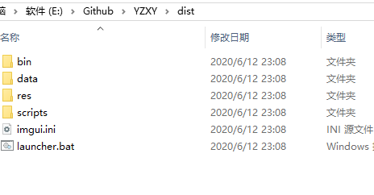

建议进群983630090下载最新的dist包，在此基础之上用lua进行开发。

dist的目录如下：

<!--  -->

dist/bin目录下有编译好的exe, cxluax.exe, SimpleEngine.exe, SimpleServer.exe.

dist/data存放游戏本体的数据文件

dist/res存放各种配置表（.tsv文件），字体，图标等等游戏本体以外的资源文件

dist/scripts下就是游戏的lua脚本文件夹了

dist下还有一个launcher.bat文件，这里面就一行命令，用来启动游戏launcher的。

`` start bin/cxluax.exe  --cwd=%cd%/ --script_path=scripts/launcher/``

